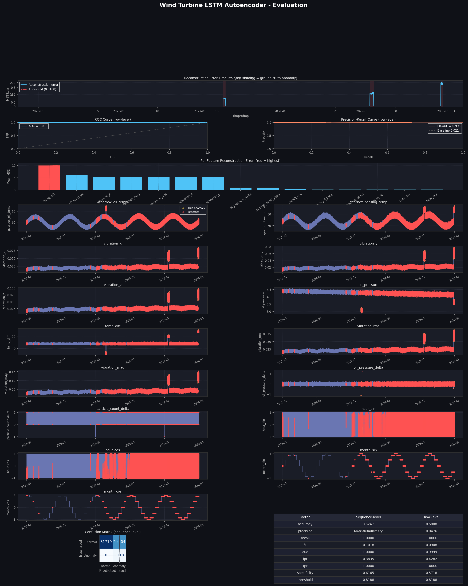
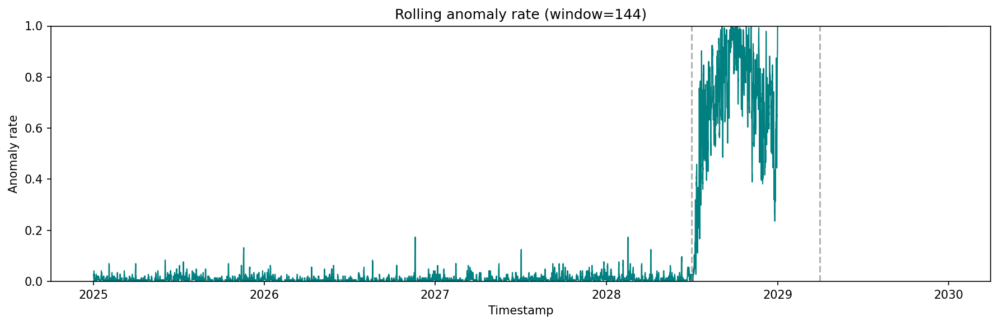

# Wind Turbine Fault Detection

[](https://www.python.org/downloads/)
[](https://pytorch.org/)
[](https://scikit-learn.org/)
[](tests/)
[](LICENSE)

Two anomaly-detection pipelines for spotting early-stage faults in wind turbine gearbox and drivetrain sensor data: an **LSTM Autoencoder** (deep learning, sequence reconstruction) and a **Local Outlier Factor (LOF)** model (density-based, statistical). Both work on multivariate time-series sensor data and flag anomalous readings to help reduce unplanned downtime.

## Dataset

Raw sensor readings live in `data/raw/` as Git LFS-tracked CSVs, one 10-minute sample per row over roughly 5 years.

| Column | Type | Description | Unit |
|---|---|---|---|
| `timestamp` | datetime | UTC timestamp of measurement | ISO 8601 |
| `gearbox_oil_temp` | float | Gearbox oil temperature | °C |
| `gearbox_bearing_temp` | float | Gearbox bearing temperature | °C |
| `vibration_x` / `_y` / `_z` | float | Vibration amplitude per axis | mm/s |
| `oil_pressure` | float | Hydraulic oil system pressure | bar |
| `particle_count` | int | Particle count in oil (contamination indicator) | count |

`turbine_5yr_complex_data.csv` is unlabeled and used by the LOF track. `turbine_5yr_labeled_data.csv` includes an `is_anomaly` column and is used by the LSTM track for threshold tuning and evaluation.

## Visuals

LSTM autoencoder evaluation dashboard (`python main.py report --track lstm`):



LOF anomaly rate over time (`python main.py report --track lof`):



## Setup

```bash
git clone https://github.com/LiamKeech/wind-turbine-fault-detection && cd wind-turbine-fault-detection
git lfs install && git lfs pull
```

Run `git lfs pull` before anything else. The dataset CSVs and saved model artefacts are Git LFS-tracked, so without it you'll only have pointer stubs.

```bash
python -m venv .venv
source .venv/bin/activate              # .venv\Scripts\activate on Windows

pip install -r requirements.txt        # add requirements-dev.txt to also run tests
```

Requires Python 3.10 or 3.11. Pinned versions are chosen for PyTorch wheel availability on that range, so check for a matching `torch` wheel before using a newer interpreter.

## CLI usage

Everything runs through `main.py`, so no notebook is required. Every subcommand takes `--track {lof,lstm}`.

```bash
# LOF track, unsupervised, no config file needed
python main.py preprocess --track lof                 # inspect + materialize features
python main.py train --track lof                      # train + save model/scaler/results
python main.py evaluate --track lof                   # re-score with the saved model
python main.py report --track lof                     # plots + summary CSVs

# LSTM autoencoder track, driven by src/config/lstm_autoencoder_config.yaml
python main.py preprocess --track lstm
python main.py train --track lstm
python main.py evaluate --track lstm
python main.py report --track lstm                    # evaluation dashboard PNG + metrics.json
```

Useful optional flags: for LOF, `--data-path`, `--output-dir`, `--rolling-window`, `--n-neighbors`, `--contamination`, `--train-frac`, `--val-frac`; for LSTM, `--config`, `--threshold-quantile`, `--exclude-features` (comma-separated, defaults to `particle_count_delta`).

Outputs land under `data/processed/lof/` and `data/processed/lstm_autoencoder/` respectively (models, scalers, results CSVs, and a `report/` subfolder with plots and metrics).

### Known limitations

The LOF anomaly threshold is fit as a score quantile on the training split only, then applied across the full, non-stationary, 5-year series. On the bundled dataset this produces a much higher overall anomaly rate than the `--contamination` value alone would suggest, so tune `--contamination`/`--n-neighbors` or retrain periodically for production use.

The LSTM config's default `threshold_quantile` (`0.999`) is very sensitive to which features are included. The original notebook run used `0.9999` and excluded `particle_count_delta` from thresholding; the CLI's `evaluate`/`report` default matches that exclusion (override with `--exclude-features ""` to include everything).

## Testing

```bash
pip install -r requirements-dev.txt
pytest tests/lof tests/lstm
```

`tests/lof/` covers preprocessing, feature engineering, model, and training. `tests/lstm/` covers the autoencoder forward pass, threshold tuning, and evaluation metrics in isolation with fixed/mocked inputs, not a freshly trained model, since training the LSTM is too slow and flaky for CI.

## Performance

From the saved `metrics.json`/`summary.csv` in each track's `report/` folder, on the bundled dataset:

| Track | Metric | Value |
|---|---|---|
| LSTM Autoencoder (sequence-level) | Precision | 0.054 |
| LSTM Autoencoder (sequence-level) | Recall | 1.000 |
| LSTM Autoencoder (sequence-level) | F1-Score | 0.102 |
| LSTM Autoencoder (sequence-level) | AUC | 1.000 |
| LOF (unsupervised, no ground-truth labels) | Anomaly rate | 27.6% (72,645 / 262,741 rows) |

LSTM precision is low relative to recall/AUC because the default `threshold_quantile` favors catching every true anomaly over minimizing false positives; see [Known limitations](#known-limitations) for tuning guidance. LOF has no labeled ground truth to score against, so it's reported as a raw anomaly rate rather than precision/recall.

## Roadmap

- Real-time inference API (e.g., FastAPI endpoint wrapping the saved LSTM/LOF models)
- CI pipeline (GitHub Actions) running `pytest` and Docker build checks on every PR
- Experiment tracking / model registry (e.g., MLflow) instead of flat files under `data/processed/`
- Ensemble scoring that combines LOF and LSTM anomaly signals
- Automatic threshold calibration against a held-out labeled set, instead of a fixed `threshold_quantile`

## Docker

```bash
git lfs pull                      # make sure real data files are on disk first
docker compose build
docker compose run --rm app train --track lof
docker compose run --rm app train --track lstm
docker compose run --rm app report --track lof
```

The image only bakes in `src/`, `main.py`, and dependencies. `data/` is mounted as a volume from the host so it always reflects whatever you've already `git lfs pull`-ed, without duplicating multi-GB LFS content into the image. See [Dockerfile](Dockerfile) and [docker-compose.yml](docker-compose.yml).

## Repository layout

```
wind-turbine-fault-detection/
├── main.py                      # CLI entrypoint for both tracks
├── requirements.txt             # pinned runtime dependencies
├── requirements-dev.txt         # + pytest, for running tests/
├── Dockerfile / docker-compose.yml
├── conftest.py                  # puts src/ on sys.path for pytest
├── data/
│   ├── raw/                     # source CSVs (Git LFS)
│   └── processed/               # pipeline outputs (LFS: *.csv/.pt/.pkl/.joblib)
│       ├── lof/                 # created by `main.py ... --track lof`
│       └── lstm_autoencoder/    # processed_features.csv, model.pt, scaler.pkl
├── notebooks/
│   ├── LOF Anomaly Detection.ipynb
│   └── LSTM Autoencoder.ipynb
├── src/
│   ├── config/lstm_autoencoder_config.yaml
│   ├── data/                    # loading, cleaning, splitting
│   ├── features/                # feature engineering
│   ├── models/                  # LOFAnomalyDetector, LSTMAutoencoder
│   ├── training/                # training loops
│   ├── evaluation/              # LSTM metrics + evaluation dashboard
│   └── visualization/           # LOF plots
└── tests/
    ├── lof/                     # unit tests for the LOF track
    └── lstm/                    # unit tests for the LSTM autoencoder track
```

## Contributions

I wrote the **LOF anomaly-detection track** end to end: preprocessing, features, model, training, evaluation, and docs (`src/**/lof_*.py`, `src/visualization/lof_plots.py`, `notebooks/LOF Anomaly Detection.ipynb`, `tests/lof/`).

The **LSTM autoencoder track** (`src/**/lstm_autoencoder_*.py`, `src/evaluation/`, `src/config/`, `notebooks/LSTM Autoencoder.ipynb`) was written by my collaborator.

`main.py`, `README.md`, `requirements*.txt`, `Dockerfile`, `docker-compose.yml`, `tests/lof/`, and `tests/lstm/` cover both tracks at the wiring and infra level but don't modify either track's modeling code.

## License

This project is licensed under the [MIT License](LICENSE).
